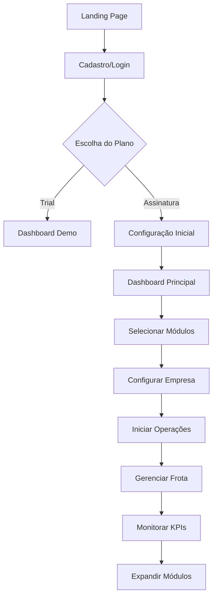
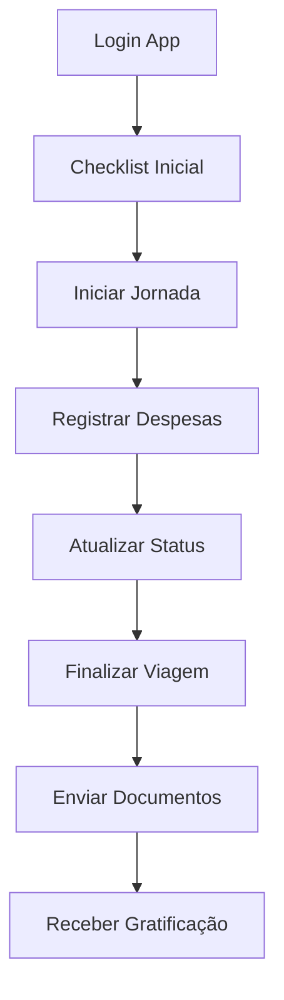

## 1. Visão Geral do Produto

Sistema de gestão logística OptiLog - plataforma inovadora para transformação digital do setor de transportes e logística. O sistema oferece uma experiência internacional com design moderno, UX intuitiva e módulos vendáveis independentes.

**Problema resolvido:** Falta de integração e modernização no setor logístico brasileiro, com sistemas desatualizados e pouco intuitivos.
**Público-alvo:** Empresas de transporte, logística, distribuição e cadeia de suprimentos de todos os portes.
**Valor de mercado:** Posicionamento como startup de tecnologia logística com potencial de expansão internacional e modelo SaaS inovador.

## 2. Recursos Principais

### 2.1 Papéis de Usuário
| Papel | Método de Registro | Permissões Principais |
|------|-------------------|----------------------|
| Admin | Convite/Cadastro direto | Acesso total a todos módulos e configurações |
| Motorista | Cadastro via app/Código QR | Acesso ao app motorista, jornada e gratificações |
| Gestor Logístico | Upgrade via admin | Dashboard, TMS, frota, motoristas, relatórios |
| Gestor Financeiro | Upgrade via admin | ERP, financeiro, aprovações, relatórios |
| Mecânico | Cadastro específico | Hub mecânico, manutenção, ordens de serviço |
| Cliente Externo | Portal web/API | Rastreamento, pedidos, documentos limitados |

### 2.2 Módulos do Sistema
**Módulos principais (vendáveis separadamente):**

1. **Dashboard Inteligente**: Analytics em tempo real, KPIs personalizados, gráficos interativos
2. **TMS (Transport Management)**: Gestão completa de transportes, rotas, fretes e documentos
3. **WMS (Warehouse Management)**: Controle de estoque, movimentações e armazém
4. **OMS (Order Management)**: Gestão de pedidos e ordens de compra
5. **Hub Mecânico**: Manutenção, ordens de serviço, controle de pneus e lava-jato
6. **App Motorista**: Jornada, checklist, despesas e comunicação em tempo real
7. **Torre de Controle**: Monitoramento em tempo real com mapas e alertas
8. **CRM Logístico**: Gestão de clientes e relacionamento
9. **ERP Integrado**: Financeiro completo com DRE, contas a pagar/receber
10. **EIP (Enterprise Integration)**: Integrações com sistemas externos

### 2.3 Detalhamento por Módulo
| Módulo | Componente Principal | Descrição das Funcionalidades |
|---------|---------------------|--------------------------------|
| Dashboard | Analytics Board | Visualizar KPIs em tempo real, gráficos interativos, exportação de relatórios |
| Dashboard | Widgets Personalizáveis | Arrastar/soltar widgets, salvar layouts personalizados |
| TMS | Gestão de Viagens | Criar, editar, acompanhar viagens com status em tempo real |
| TMS | MDF-e | Emissão automática de documentos fiscais eletrônicos |
| WMS | Controle de Estoque | Inventário, movimentações, alertas de níveis mínimos |
| WMS | Localização de Produtos | Rastreamento por código de barras/QR Code |
| Hub Mecânico | Ordens de Serviço | Criar OS, atribuir mecânicos, acompanhar progresso |
| Hub Mecânico | Manutenção Preventiva | Agendamento automático baseado em quilometragem/tempo |
| App Motorista | Checklist Digital | Checklists obrigatórios com fotos e assinatura digital |
| App Motorista | Jornada de Trabalho | Controle de ponto, horas dirigidas, descanso |
| Torre Controle | Mapa em Tempo Real | Visualização de veículos com cores por status |
| Torre Controle | Alertas Inteligentes | Notificações automáticas por e-mail/SMS/Push |
| CRM | Gestão de Clientes | Cadastro, histórico, análise de satisfação |
| ERP | Financeiro | Contas a pagar/receber, fluxo de caixa, DRE |
| ERP | Conciliação Bancária | Importação automática de extratos, reconciliação |
| Configurações | Empresa/Domínio | Personalização de marca, domínio personalizado |
| Configurações | Internacionalização | Multi-idioma, fusos horários, moedas |
| Configurações | Temas | Claro/escuro com cores personalizáveis |

## 3. Fluxos Principais

### 3.1 Fluxo do Cliente

### 3.2 Fluxo do Motorista

## 4. Design de Interface

### 4.1 Estilo de Design
**Conceito:** "Logistics Intelligence Interface" - Design moderno inspirado em centros de controle aeroespacial

**Elementos Visuais:**
- **Cores Primárias:** Azul elétrico (#0066FF), Verde limão (#00FF88), Laranja alerta (#FF6B35)
- **Cores Secundárias:** Cinza escuro (#1A1A1A), Cinza médio (#4A4A4A), Branco (#FFFFFF)
- **Botões:** Estilo 3D com gradientes, efeitos de hover com brilho, bordas arredondadas
- **Tipografia:** Fonte Roboto para interfaces, tamanhos responsivos (12px-24px)
- **Layout:** Card-based com sombras profundas, grid responsivo de 12 colunas
- **Ícones:** Estilo outline do Lucide React, com animações sutis
- **Animações:** Transições suaves (0.3s), micro-interações em hover, loading skeletons

### 4.2 Sistema de Temas
**Tema Claro:**
- Background: #FFFFFF
- Surface: #F8F9FA
- Primary: #0066FF
- Text: #1A1A1A
- Border: #E9ECEF

**Tema Escuro:**
- Background: #0A0A0A
- Surface: #1A1A1A
- Primary: #00FF88
- Text: #FFFFFF
- Border: #333333

### 4.3 Componentes de Interface
| Página | Módulo | Elementos de UI |
|--------|--------|-----------------|
| Dashboard | Hero Section | Cards com gradientes animados, KPIs com números grandes e cores de status |
| Dashboard | Gráficos | Gráficos interativos do Recharts com tooltips customizados |
| TMS | Lista de Viagens | Tabela com sorting, filtros, status coloridos, ações em dropdown |
| Torre Controle | Mapa | Mapa Leaflet com clusters, cores por status, popups informativos |
| App Motorista | Interface Mobile | Design mobile-first, botões grandes, gestos de swipe |
| Configurações | Painel | Abas organizadas, switches animados, preview em tempo real |

### 4.4 Internacionalização (i18n)
**Idiomas Suportados:**
- Português (Brasil) - Padrão
- English (US)
- Español (Latam)
- Français (France)

**Elementos de Idioma:**
- Botão de seleção no header com bandeiras
- Troca instantânea sem reload
- Formatação regional (datas, moedas, números)
- RTL support para idiomas futuros

### 4.5 Responsividade
**Desktop-First:** Otimizado para telas grandes (1920x1080)
**Breakpoints:**
- Mobile: 320px - 768px
- Tablet: 768px - 1024px  
- Desktop: 1024px - 1920px
- Ultra-wide: 1920px+

**Touch Optimization:**
- Botões mínimos 44x44px
- Gestos de swipe para mobile
- Touch-friendly dropdowns
- Zoom prevention em inputs

## 5. Diferenciais de Startup

### 5.1 Inovações Tecnológicas
**AI-Powered Logistics:**
- Previsão de demanda com machine learning
- Otimização de rotas em tempo real
- Chatbot inteligente para suporte 24/7
- Análise preditiva de manutenção

**Blockchain Integration:**
- Rastreamento imutável de cargas
- Smart contracts para pagamentos automáticos
- Certificação de origem de produtos

**IoT & Real-time:**
- Sensores de temperatura/umidade integrados
- Monitoramento de combustível em tempo real
- Alertas geolocalizados inteligentes

### 5.2 Modelo de Negócio SaaS
**Freemium Strategy:**
- Trial 30 dias full features
- Plano gratuito limitado para pequenas frotas
- Módulos vendáveis separadamente
- White-label para grandes clientes

**Pricing Inovador:**
- Pay-per-use para módulos específicos
- Preço dinâmico baseado em volume
- Descontos por sustentabilidade
- Cashback por eficiência logística

### 5.3 Expansão Global
**Estratégia Silicon Valley:**
- MVP focado em problemas globais de logística
- Escalabilidade cloud-native
- API-first para integrações
- Comunidade open-source de plugins

**Parcerias Estratégicas:**
- Integração com marketplaces (Mercado Livre, Amazon)
- APIs públicas para desenvolvedores
- Programa de parceiros logísticos
- Certificações internacionais ISO

## 6. Implementação e Roadmap

### 6.1 Fase 1 - Foundation (Mês 1-2)
- Sistema de temas claro/escuro
- Internacionalização básica
- Design system componentizado
- Configurações de empresa/dominio

### 6.2 Fase 2 - UX Revolution (Mês 3-4)
- Redesign completo da interface
- Animações e micro-interações
- Otimização mobile
- Acessibilidade WCAG 2.1

### 6.3 Fase 3 - Advanced Features (Mês 5-6)
- IA conversacional avançada
- Analytics preditivo
- Integrações blockchain
- Marketplace de plugins

### 6.4 Fase 4 - Global Scale (Mês 7-12)
- Expansão internacional
- Certificações global
- Parcerias estratégicas
- IPO