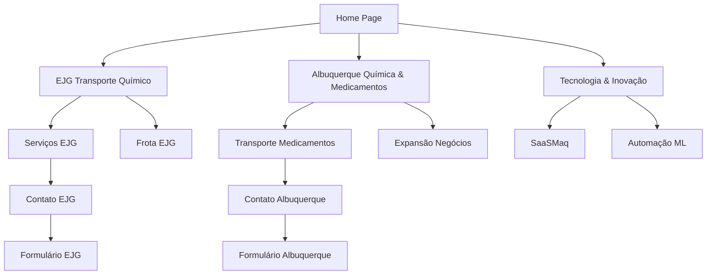

## 1. Product Overview
Site institucional da EJG Transporte Químico, especializada em transporte de produtos químicos com foco em inovação, segurança e eficiência. A empresa oferece serviços de transporte químico e medicamentos com tecnologia de monitoramento avançada, frota própria e motoristas treinados.

O site apresenta as duas divisões da empresa: EJG Transporte Químico e Albuquerque Química & Transporte de Medicamentos, ambas com sistemas desenvolvidos pela XYZLogicFlow.

## 2. Core Features

### 2.1 User Roles
| Role | Registration Method | Core Permissions |
|------|---------------------|------------------|
| Visitor | No registration required | Browse all public content, access contact forms |
| Admin | Backend registration | Manage content, update fleet information, view analytics |

### 2.2 Feature Module
Site institucional com as seguintes páginas principais:
1. **Home page**: hero section com apresentação das duas divisões, navegação principal, seção de inovação e tecnologia.
2. **EJG Transporte Químico**: detalhes dos serviços de transporte químico, frota, tecnologia SaaSMaq.
3. **Albuquerque Química & Medicamentos**: especialização em transporte de medicamentos, expansão de negócios.
4. **Tecnologia & Inovação**: sistema de monitoramento, automação ML, IA preditiva, gestão de frotas.
5. **Contato**: formulários de contato para ambas as divisões, informações de localização.

### 2.3 Page Details
| Page Name | Module Name | Feature description |
|-----------|-------------|---------------------|
| Home page | Hero section | Apresentação visual das duas divisões da empresa com logos e botões de acesso direto. Slider automático com imagens da frota e operações. |
| Home page | Navigation bar | Menu principal com links para todas as seções do site. Logo da empresa e botões de acesso rápido para EJG e Albuquerque. |
| Home page | Innovation showcase | Demonstração das tecnologias utilizadas: SaaSMaq, automação ML, IA preditiva, monitoramento em tempo real. |
| Home page | Services overview | Cards visuais resumindo os serviços de transporte químico e medicamentos. |
| EJG Transporte | Fleet presentation | Galeria de imagens da frota própria com descrições técnicas e capacidades. |
| EJG Transporte | Driver training | Seção destacando o programa de treinamento dos motoristas e certificações. |
| EJG Transporte | Maintenance system | Apresentação do sistema de manutenção própria e preventiva. |
| EJG Transporte | SaaSMaq monitoring | Detalhes do sistema de monitoramento SaaSMaq desenvolvido pela XYZLogicFlow. |
| Albuquerque Química | Pharmaceutical transport | Especialização em transporte de medicamentos com controle de temperatura e segurança. |
| Albuquerque Química | Business expansion | Informações sobre expansão de negócios e crescimento da frota. |
| Albuquerque Química | Vehicle management | Sistema de gestão de veículos e frotas com tecnologia avançada. |
| Technology | ML Automation | Demonstração da automação com Machine Learning para otimização de rotas. |
| Technology | Predictive IA | Sistema de IA preditiva para manutenção preventiva e previsão de demanda. |
| Technology | Fleet management | Plataforma unificada de gestão de frotas e operações. |
| Contact | Contact forms | Formulários separados para contato com EJG Transporte e Albuquerque Química. |
| Contact | Location info | Mapas e informações de endereço para ambas as divisões. |
| Contact | Quick access | Botões diretos para WhatsApp Business e email corporativo. |

## 3. Core Process
**Visitor Flow**: Usuário acessa a homepage → Visualiza apresentação das divisões → Navega pelas seções de serviços → Acessa informações de tecnologia → Entra em contato através dos formulários.

**Navigation Flow**: Homepage oferece acesso direto às duas divisões principais, cada seção tem navegação independente mas integrada, sempre com fácil retorno à página principal.

## 4. User Interface Design
### 4.1 Design Style
- **Cores primárias**: Azul industrial (#1E3A8A) e verde segurança (#059669)
- **Cores secundárias**: Cinza metálico (#6B7280) e branco (#FFFFFF)
- **Botões**: Estilo arredondado com hover effects, cores que indicam ação
- **Fontes**: Inter para textos, Roboto Condensed para títulos principais
- **Layout**: Card-based design com seções bem definidas e navegação intuitiva
- **Ícones**: Ícones industriais e de transporte, com estilo flat design moderno

### 4.2 Page Design Overview
| Page Name | Module Name | UI Elements |
|-----------|-------------|-------------|
| Home page | Hero section | Slider full-width com imagens da frota, overlay com logos EJG e Albuquerque lado a lado, botões de acesso primários em destaque. |
| Home page | Services cards | Cards responsivos com ícones representando cada serviço, hover effects com transições suaves. |
| EJG page | Fleet gallery | Grid de imagens da frota com lightbox para visualização ampliada, informações técnicas em cards sobrepostos. |
| Technology | Innovation timeline | Timeline vertical mostrando evolução tecnológica, com animação de scroll. |
| Contact | Dual forms | Layout split-screen com formulários lado a lado para cada divisão, mapas interativos integrados. |

### 4.3 Responsiveness
Desktop-first design com adaptação responsiva para tablets e smartphones. Otimização para touch em dispositivos móveis com botões aumentados e navegação hamburger menu. Layout fluido que mantém hierarquia visual em todas as resoluções.