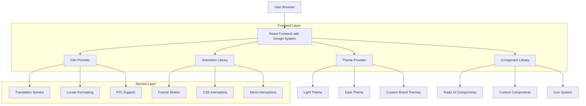
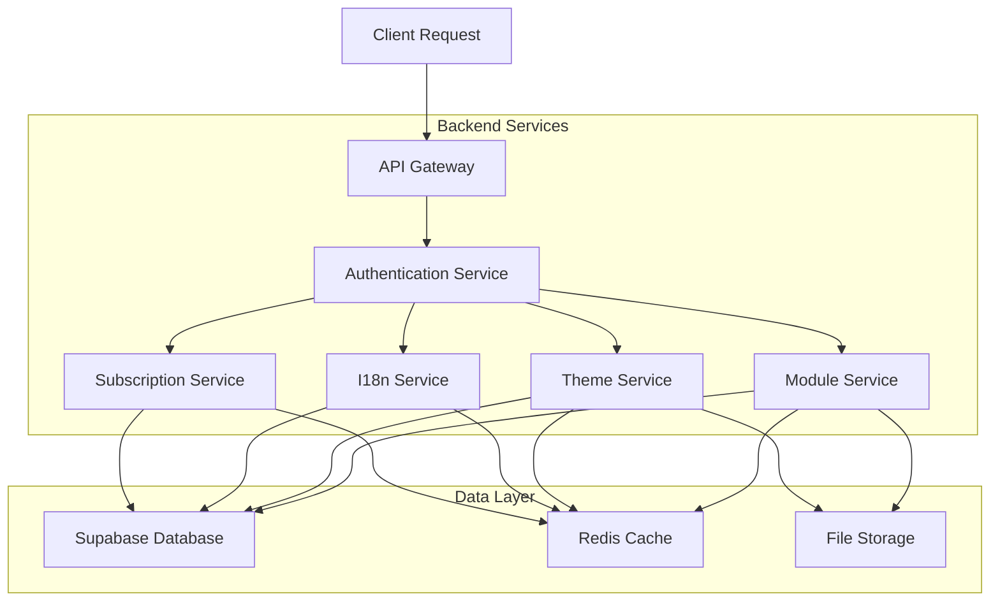
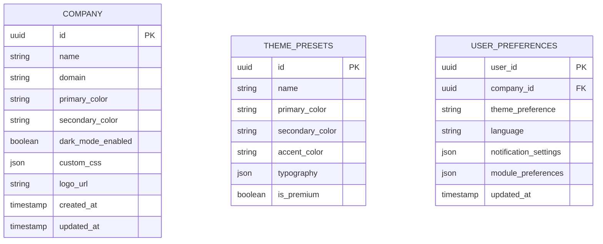
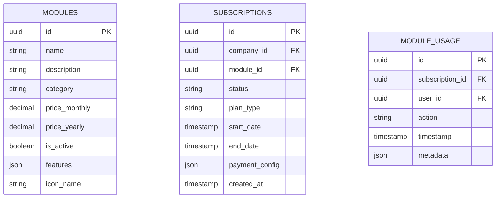
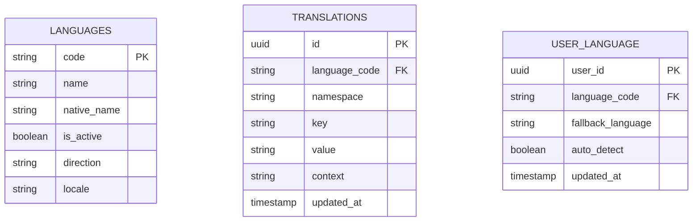

## 1. Arquitetura de Design System e UX



## 2. Tecnologias e Dependências

### Frontend Stack
- **Framework:** React@18 com TypeScript
- **Build Tool:** Vite (configurado)
- **Estilização:** TailwindCSS@3 + CSS Modules
- **Componentes:** Radix UI + Custom Design System
- **Animações:** Framer-motion@12, Lottie React
- **Ícones:** Lucide React + Custom Icon Library
- **Temas:** next-themes@0.3 (já instalado)
- **i18n:** react-i18next + i18next-browser-languagedetector
- **Charts:** Recharts@3 (já instalado)
- **Mapas:** Leaflet@1.9 + React-Leaflet

### Novas Dependências Necessárias
```json
{
  "react-i18next": "^15.0.0",
  "i18next": "^24.0.0",
  "i18next-browser-languagedetector": "^8.0.0",
  "i18next-http-backend": "^3.0.0",
  "react-helmet-async": "^2.0.0",
  "@react-three/fiber": "^8.0.0",
  "@react-three/drei": "^9.0.0",
  "three": "^0.160.0",
  "lottie-react": "^2.4.0",
  "react-spring": "^9.7.0",
  "use-sound": "^4.0.0",
  "react-colorful": "^5.6.0",
  "react-intersection-observer": "^9.5.0"
}
```

## 3. Definições de Rotas

### Rotas de Configuração e Personalização
| Rota | Propósito | Componente |
|------|-----------|------------|
| /settings/appearance | Configuração de temas e cores | ThemeSettings |
| /settings/branding | Personalização de marca | BrandingSettings |
| /settings/internationalization | Configurações de idioma | I18nSettings |
| /settings/domain | Configuração de domínio customizado | DomainSettings |
| /settings/modules | Gerenciamento de módulos | ModuleManager |
| /settings/notifications | Preferências de notificações | NotificationSettings |
| /marketplace | Loja de módulos e plugins | ModuleMarketplace |
| /onboarding | Fluxo de configuração inicial | OnboardingFlow |

### Rotas de Módulos Vendáveis
| Rota | Módulo | Acesso |
|------|--------|--------|
| /dashboard/analytics | Dashboard Premium | Assinatura Pro |
| /tms/advanced | TMS Avançado | Módulo TMS |
| /wms/premium | WMS Premium | Módulo WMS |
| /ai/chatbot | IA Conversacional | Módulo AI |
| /blockchain/tracking | Blockchain Tracking | Módulo Enterprise |
| /api/developer | APIs e Integrações | Módulo Developer |

## 4. Definições de API

### 4.1 APIs de Configuração e Personalização

#### Theme Configuration API
```
POST /api/settings/theme
```
Request:
| Parâmetro | Tipo | Obrigatório | Descrição |
|-----------|------|-------------|-----------|
| primaryColor | string | true | Cor primária em HEX |
| secondaryColor | string | true | Cor secundária em HEX |
| darkMode | boolean | true | Habilitar modo escuro |
| customCSS | string | false | CSS customizado |

Response:
```json
{
  "success": true,
  "themeId": "theme_123",
  "previewUrl": "/preview/theme_123"
}
```

#### Domain Configuration API
```
POST /api/settings/domain
```
Request:
| Parâmetro | Tipo | Obrigatório | Descrição |
|-----------|------|-------------|-----------|
| customDomain | string | true | Domínio customizado |
| sslCertificate | file | false | Certificado SSL |
| brandingLogo | file | false | Logo da empresa |

#### Module Subscription API
```
POST /api/modules/subscribe
```
Request:
| Parâmetro | Tipo | Obrigatório | Descrição |
|-----------|------|-------------|-----------|
| moduleId | string | true | ID do módulo |
| subscriptionType | string | true | Tipo de assinatura |
| paymentMethod | string | true | Método de pagamento |

### 4.2 APIs de Internacionalização

#### Language Detection API
```
GET /api/i18n/detect-language
```
Response:
```json
{
  "language": "pt-BR",
  "region": "BR",
  "supported": true,
  "alternatives": ["en-US", "es-ES"]
}
```

#### Translation API
```
GET /api/i18n/translate
```
Query Parameters:
| Parâmetro | Tipo | Obrigatório | Descrição |
|-----------|------|-------------|-----------|
| text | string | true | Texto para traduzir |
| targetLang | string | true | Idioma alvo |
| context | string | false | Contexto da tradução |

## 5. Arquitetura do Servidor



### 5.1 Services Architecture

#### Theme Service
- Gerencia configurações de temas
- Processa uploads de logos e assets
- Gera CSS dinâmico
- Cache de temas ativos

#### I18n Service
- Detecção automática de idioma
- Gerenciamento de traduções
- Formatação regional
- Fallback para idiomas não suportados

#### Module Service
- Gerenciamento de módulos ativos
- Controle de licenças
- Ativação/desativação de features
- Billing integration

#### Subscription Service
- Gestão de assinaturas
- Processamento de pagamentos
- Trial management
- Upgrade/downgrade de planos

## 6. Modelo de Dados

### 6.1 Configurações de Tema e Branding


### 6.2 Módulos e Assinaturas


### 6.3 Internacionalização


## 7. DDL - Data Definition Language

### 7.1 Tabelas de Configuração
```sql
-- Tabela de Empresas
CREATE TABLE companies (
  id UUID PRIMARY KEY DEFAULT gen_random_uuid(),
  name VARCHAR(255) NOT NULL,
  domain VARCHAR(255) UNIQUE,
  primary_color VARCHAR(7) DEFAULT '#0066FF',
  secondary_color VARCHAR(7) DEFAULT '#00FF88',
  accent_color VARCHAR(7) DEFAULT '#FF6B35',
  dark_mode_enabled BOOLEAN DEFAULT false,
  custom_css TEXT,
  logo_url TEXT,
  favicon_url TEXT,
  branding_config JSONB DEFAULT '{}',
  created_at TIMESTAMP WITH TIME ZONE DEFAULT NOW(),
  updated_at TIMESTAMP WITH TIME ZONE DEFAULT NOW()
);

-- Tabela de Temas Pré-definidos
CREATE TABLE theme_presets (
  id UUID PRIMARY KEY DEFAULT gen_random_uuid(),
  name VARCHAR(100) NOT NULL,
  primary_color VARCHAR(7) NOT NULL,
  secondary_color VARCHAR(7) NOT NULL,
  accent_color VARCHAR(7) NOT NULL,
  typography_config JSONB DEFAULT '{}',
  is_premium BOOLEAN DEFAULT false,
  preview_image_url TEXT,
  created_at TIMESTAMP WITH TIME ZONE DEFAULT NOW()
);

-- Índices
CREATE INDEX idx_companies_domain ON companies(domain);
CREATE INDEX idx_companies_name ON companies(name);
```

### 7.2 Tabelas de Módulos
```sql
-- Tabela de Módulos Disponíveis
CREATE TABLE modules (
  id UUID PRIMARY KEY DEFAULT gen_random_uuid(),
  name VARCHAR(100) NOT NULL,
  description TEXT,
  category VARCHAR(50) NOT NULL,
  price_monthly DECIMAL(10,2) DEFAULT 0.00,
  price_yearly DECIMAL(10,2) DEFAULT 0.00,
  is_active BOOLEAN DEFAULT true,
  features JSONB DEFAULT '[]',
  icon_name VARCHAR(100),
  dependencies JSONB DEFAULT '[]',
  created_at TIMESTAMP WITH TIME ZONE DEFAULT NOW(),
  updated_at TIMESTAMP WITH TIME ZONE DEFAULT NOW()
);

-- Tabela de Assinaturas
CREATE TABLE subscriptions (
  id UUID PRIMARY KEY DEFAULT gen_random_uuid(),
  company_id UUID REFERENCES companies(id) ON DELETE CASCADE,
  module_id UUID REFERENCES modules(id) ON DELETE CASCADE,
  status VARCHAR(20) DEFAULT 'active' CHECK (status IN ('active', 'suspended', 'cancelled', 'trial')),
  plan_type VARCHAR(20) DEFAULT 'monthly' CHECK (plan_type IN ('monthly', 'yearly', 'custom')),
  start_date TIMESTAMP WITH TIME ZONE DEFAULT NOW(),
  end_date TIMESTAMP WITH TIME ZONE,
  trial_end_date TIMESTAMP WITH TIME ZONE,
  payment_config JSONB DEFAULT '{}',
  usage_limits JSONB DEFAULT '{}',
  created_at TIMESTAMP WITH TIME ZONE DEFAULT NOW(),
  updated_at TIMESTAMP WITH TIME ZONE DEFAULT NOW(),
  UNIQUE(company_id, module_id)
);

-- Índices
CREATE INDEX idx_subscriptions_company ON subscriptions(company_id);
CREATE INDEX idx_subscriptions_module ON subscriptions(module_id);
CREATE INDEX idx_subscriptions_status ON subscriptions(status);
```

### 7.3 Tabelas de Internacionalização
```sql
-- Tabela de Idiomas
CREATE TABLE languages (
  code VARCHAR(10) PRIMARY KEY,
  name VARCHAR(100) NOT NULL,
  native_name VARCHAR(100) NOT NULL,
  is_active BOOLEAN DEFAULT true,
  direction VARCHAR(10) DEFAULT 'ltr' CHECK (direction IN ('ltr', 'rtl')),
  locale VARCHAR(20),
  created_at TIMESTAMP WITH TIME ZONE DEFAULT NOW()
);

-- Tabela de Traduções
CREATE TABLE translations (
  id UUID PRIMARY KEY DEFAULT gen_random_uuid(),
  language_code VARCHAR(10) REFERENCES languages(code) ON DELETE CASCADE,
  namespace VARCHAR(100) DEFAULT 'common',
  key VARCHAR(255) NOT NULL,
  value TEXT NOT NULL,
  context VARCHAR(255),
  is_verified BOOLEAN DEFAULT false,
  created_at TIMESTAMP WITH TIME ZONE DEFAULT NOW(),
  updated_at TIMESTAMP WITH TIME ZONE DEFAULT NOW(),
  UNIQUE(language_code, namespace, key)
);

-- Tabela de Preferências de Usuário
CREATE TABLE user_preferences (
  user_id UUID PRIMARY KEY REFERENCES auth.users(id) ON DELETE CASCADE,
  company_id UUID REFERENCES companies(id) ON DELETE CASCADE,
  theme_preference VARCHAR(50) DEFAULT 'system',
  language_code VARCHAR(10) REFERENCES languages(code),
  fallback_language VARCHAR(10) DEFAULT 'en',
  auto_detect_language BOOLEAN DEFAULT true,
  notification_settings JSONB DEFAULT '{}',
  module_preferences JSONB DEFAULT '{}',
  accessibility_settings JSONB DEFAULT '{}',
  updated_at TIMESTAMP WITH TIME ZONE DEFAULT NOW()
);

-- Índices
CREATE INDEX idx_translations_language ON translations(language_code);
CREATE INDEX idx_translations_namespace ON translations(namespace);
CREATE INDEX idx_translations_key ON translations(key);
CREATE INDEX idx_user_preferences_company ON user_preferences(company_id);
```

### 7.4 Dados Iniciais
```sql
-- Idiomas Padrão
INSERT INTO languages (code, name, native_name, direction, locale) VALUES
  ('pt-BR', 'Portuguese (Brazil)', 'Português (Brasil)', 'ltr', 'pt_BR'),
  ('en-US', 'English (US)', 'English (US)', 'ltr', 'en_US'),
  ('es-ES', 'Spanish (Spain)', 'Español (España)', 'ltr', 'es_ES'),
  ('fr-FR', 'French (France)', 'Français (France)', 'ltr', 'fr_FR');

-- Módulos Padrão
INSERT INTO modules (name, description, category, price_monthly, price_yearly, is_active, icon_name) VALUES
  ('Dashboard', 'Analytics e KPIs em tempo real', 'analytics', 99.00, 999.00, true, 'LayoutDashboard'),
  ('TMS', 'Transport Management System', 'logistics', 299.00, 2999.00, true, 'Truck'),
  ('WMS', 'Warehouse Management System', 'logistics', 199.00, 1999.00, true, 'Warehouse'),
  ('Hub Mecânico', 'Gestão de manutenção e oficina', 'maintenance', 149.00, 1499.00, true, 'Wrench'),
  ('App Motorista', 'Aplicativo para motoristas', 'mobile', 49.00, 499.00, true, 'User'),
  ('Torre de Controle', 'Monitoramento em tempo real', 'monitoring', 199.00, 1999.00, true, 'TowerControl'),
  ('CRM', 'Customer Relationship Management', 'sales', 99.00, 999.00, true, 'UserCheck'),
  ('ERP', 'Enterprise Resource Planning', 'finance', 399.00, 3999.00, true, 'Building2'),
  ('IA Conversacional', 'Chatbot inteligente', 'ai', 149.00, 1499.00, true, 'Brain'),
  ('Blockchain', 'Rastreamento blockchain', 'blockchain', 299.00, 2999.00, false, 'Shield');

-- Traduções Básicas
INSERT INTO translations (language_code, namespace, key, value) VALUES
  ('pt-BR', 'common', 'welcome', 'Bem-vindo ao OptiLog'),
  ('pt-BR', 'common', 'dashboard', 'Dashboard'),
  ('pt-BR', 'common', 'fleet', 'Frota'),
  ('en-US', 'common', 'welcome', 'Welcome to OptiLog'),
  ('en-US', 'common', 'dashboard', 'Dashboard'),
  ('en-US', 'common', 'fleet', 'Fleet'),
  ('es-ES', 'common', 'welcome', 'Bienvenido a OptiLog'),
  ('es-ES', 'common', 'dashboard', 'Panel'),
  ('es-ES', 'common', 'fleet', 'Flota');
```

## 8. Segurança e Performance

### 8.1 Políticas de Segurança (RLS)
```sql
-- Políticas para Companies
CREATE POLICY "Users can view their company"
  ON companies FOR SELECT
  USING (id IN (SELECT company_id FROM user_preferences WHERE user_id = auth.uid()));

CREATE POLICY "Admins can manage companies"
  ON companies FOR ALL
  USING (has_role(auth.uid(), 'admin'));

-- Políticas para Subscriptions
CREATE POLICY "Users can view company subscriptions"
  ON subscriptions FOR SELECT
  USING (company_id IN (SELECT company_id FROM user_preferences WHERE user_id = auth.uid()));

CREATE POLICY "Admins can manage subscriptions"
  ON subscriptions FOR ALL
  USING (has_role(auth.uid(), 'admin'));
```

### 8.2 Otimizações de Performance
- **Redis Cache:** Para temas e traduções frequentes
- **CDN:** Assets estáticos e arquivos de idioma
- **Lazy Loading:** Módulos carregados sob demanda
- **Code Splitting:** Bundle optimization por rota
- **Image Optimization:** WebP format com fallback

## 9. Monitoramento e Analytics

### 9.1 User Analytics
- Tracking de uso por módulo
- Análise de fluxo de usuário
- Heatmaps de interação
- Performance metrics

### 9.2 System Monitoring
- Uptime monitoring
- Error tracking (Sentry)
- Performance monitoring
- Real-time alerts

### 9.3 Business Intelligence
- Revenue tracking por módulo
- Churn analysis
- User engagement metrics
- Conversion funnel analysis