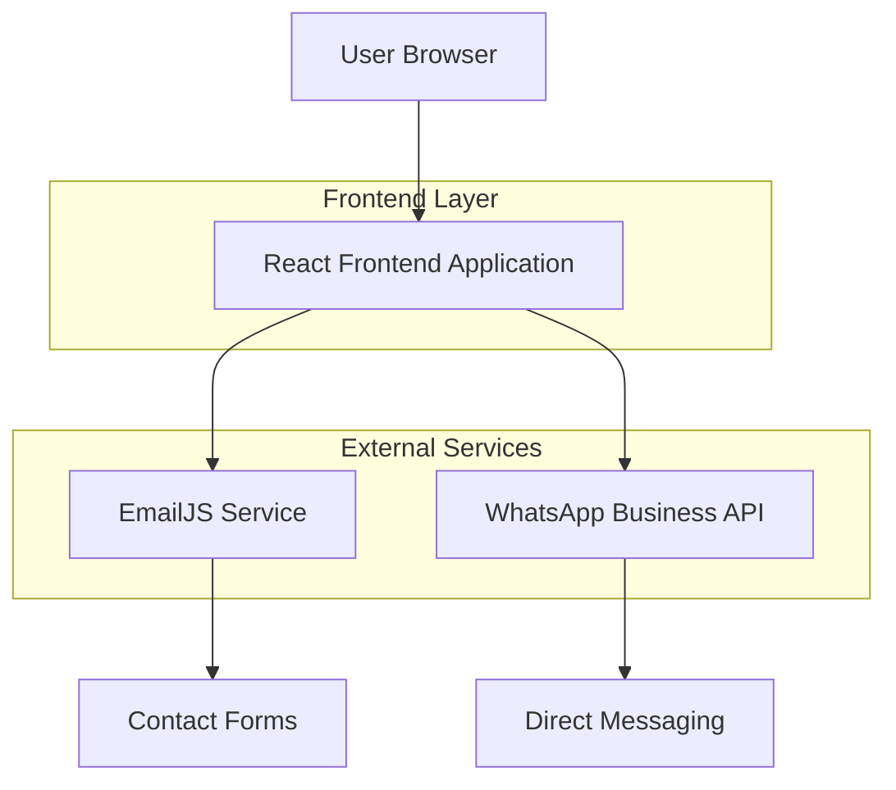
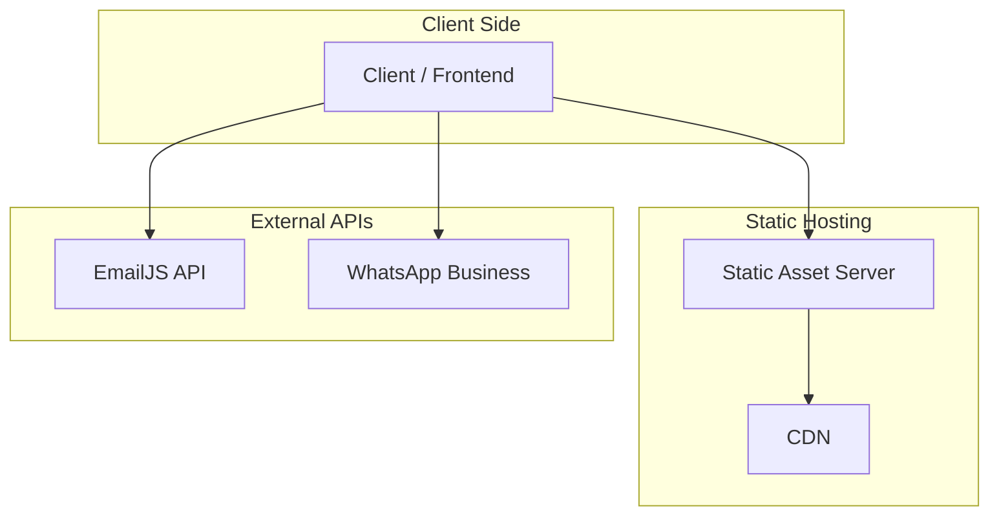

## 1. Architecture design



## 2. Technology Description
- Frontend: React@18 + tailwindcss@3 + vite
- Initialization Tool: vite-init
- Backend: None (static site with external services)
- Contact Integration: EmailJS + WhatsApp Business API
- Animation Library: Framer Motion
- Icons: React Icons + Lucide React

## 3. Route definitions
| Route | Purpose |
|-------|---------|
| / | Homepage com apresentação das divisões e hero section |
| /ejg-transporte | Página detalhada da EJG Transporte Químico |
| /albuquerque-quimica | Página da Albuquerque Química & Medicamentos |
| /tecnologia | Showcase de tecnologias SaaSMaq, ML e IA |
| /contato | Página de contato com formulários duplos |
| /sobre | Informações corporativas e história |

## 4. API definitions
### 4.1 Contact Form Integration

EmailJS configuration for EJG Transporte
```javascript
// Service configuration
emailjs.init("YOUR_PUBLIC_KEY");

// Form submission
emailjs.sendForm('service_ejg', 'template_contact_ejg', form)
```

WhatsApp Business API integration
```javascript
// Direct WhatsApp links
https://wa.me/+5511999999999?text=Olá,%20gostaria%20de%20informações%20sobre%20transporte%20químico
```

## 5. Server architecture diagram


## 6. Data model
### 6.1 Contact Form Data Structure
```javascript
// EJG Contact Form
interface EJGContactForm {
  name: string;
  email: string;
  phone: string;
  company: string;
  serviceType: 'transporte-quimico' | 'manutencao' | 'consultoria';
  message: string;
  urgency: 'low' | 'medium' | 'high';
}

// Albuquerque Contact Form
interface AlbuquerqueContactForm {
  name: string;
  email: string;
  phone: string;
  pharmaceuticalCompany: string;
  medicationType: string;
  volume: string;
  temperatureRequirement: string;
  message: string;
}
```

### 6.2 Component Structure
```javascript
// Main layout components
components/
├── layout/
│   ├── Header.jsx
│   ├── Footer.jsx
│   └── Navigation.jsx
├── home/
│   ├── HeroSection.jsx
│   ├── DivisionCards.jsx
│   └── InnovationShowcase.jsx
├── ejg/
│   ├── FleetGallery.jsx
│   ├── ServicesSection.jsx
│   └── TechnologyHighlight.jsx
├── albuquerque/
│   ├── PharmaTransport.jsx
│   ├── ExpansionSection.jsx
│   └── VehicleManagement.jsx
├── contact/
│   ├── DualContactForms.jsx
│   ├── LocationMap.jsx
│   └── QuickAccessButtons.jsx
└── shared/
    ├── Button.jsx
    ├── Card.jsx
    └── Icon.jsx
```

## 7. Performance Optimization
- Lazy loading para imagens da frota
- Code splitting por páginas
- Cache estático via service worker
- Imagens otimizadas em WebP com fallback
- Fontes otimizadas e subsetadas
- CSS crítico inline para renderização rápida

## 8. SEO Configuration
- Meta tags dinâmicas por página
- Schema.org para empresas de transporte
- Sitemap.xml automático
- Robots.txt otimizado
- Open Graph tags para redes sociais
- Structured data para serviços de transporte