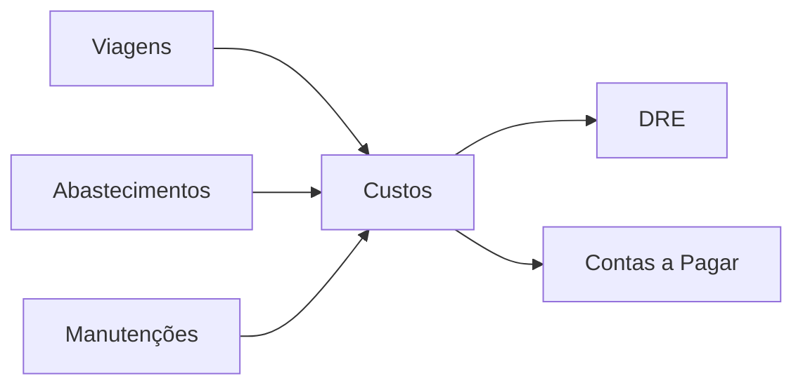
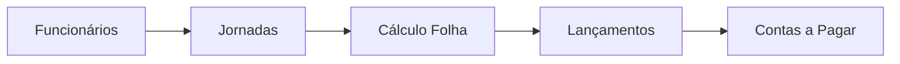
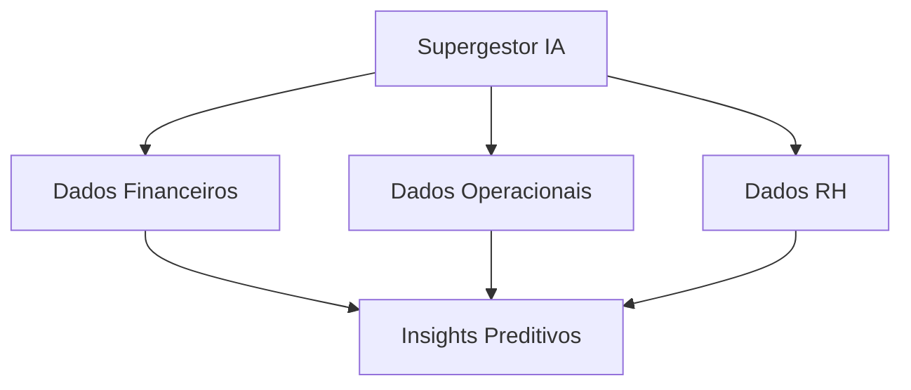

# 🚀 Melhorias Implementadas - Janeiro 2026

## ✅ Melhorias Concluídas

### 1. **Sidebar Reorganizada com Categorias** 
- ✨ **Módulos organizados em categorias visíveis**
  - Principal (Dashboard, Torre de Controle, Supergestor IA)
  - Sistemas Core (ERP, TMS, WMS, CRM, SCM)
  - Gestão Operacional (Frota, Motoristas, Funcionários, Jornadas)
  - Financeiro (KPIs, Custos, Conciliação, Contas a Pagar/Receber, DRE, Folha)
  - Apps & Ferramentas (App Motorista, Hub Mecânico, Aprovações, Documentos, Exportações)
  - Inovação & Tech (Innovation Lab, IoT, ESG, Developer)
  - Configurações (Usuários, Permissões, Relatórios, Settings)

- 🎯 **Benefícios:**
  - Navegação mais intuitiva
  - Separadores visuais entre categorias
  - Identificação rápida de módulos
  - Layout responsivo (colapsa para ícones apenas)

### 2. **Central de Exportações**
📦 **Nova página: `/export-center`**

Exportação completa de dados do sistema:
- ✅ CTe (Conhecimentos de Transporte)
- ✅ Veículos e Placas
- ✅ Motoristas
- ✅ Funcionários  
- ✅ Viagens
- ✅ Abastecimentos
- ✅ Ordens de Serviço

**Formatos suportados:**
- CSV (implementado)
- JSON (implementado)
- Excel/XLSX (planejado)

**Recursos:**
- Exportação rápida com atalhos
- Seleção de tipo de dados
- Download automático
- Contagem de registros exportados

### 3. **ErrorBoundary Global**
🛡️ **Tratamento de erros robusto**

- Captura erros de React em qualquer componente
- UI amigável para erros
- Botões de ação (Tentar Novamente, Voltar ao Início)
- Stack trace em modo desenvolvimento
- Preparado para integração com Sentry/LogRocket

### 4. **Dashboard Executivo Integrado**
📊 **Nova página: `/executive-dashboard`**

Visão consolidada de todos os módulos:
- **Gestão Financeira** (DRE, Fluxo de Caixa, Contas, KPIs)
- **Gestão Operacional** (Torre, Frota, Motoristas, Manutenção, Custos)
- **Recursos Humanos** (Funcionários, Folha, Jornadas, Aprovações)
- **Relatórios & Analytics** (Supergestor IA, Relatórios, Exportação, Innovation)

**Integrações destacadas:**
- Financeiro ↔ Operacional
- RH ↔ Folha de Pagamento
- IA ↔ Todos os Módulos

### 5. **Arquivo .env.example Completo**
📝 **Documentação de variáveis de ambiente**

Incluindo:
- Configuração Supabase (URL, Keys)
- AI Provider (OpenAI, modelos, limites)
- APIs Externas (TomTom, OpenRoute, EmailJS, WhatsApp)
- Brasil API (CTe, MDFe, NF-e)
- N8n Webhooks
- CORS settings

### 6. **Melhorias de UX/UI**

#### Sidebar:
- Separadores visuais entre categorias
- Títulos de categoria em uppercase
- Hover states melhorados
- Active state destacado com cor primária
- Ícones mais intuitivos

#### Navegação:
- Breadcrumbs implícitos via categorias
- Links mais descritivos
- Organização lógica por função

## 🔧 Integrações entre Módulos

### Financeiro ↔ Operacional


**Implementação:**
- Custos de viagens refletidos automaticamente no DRE
- Abastecimentos vinculados a contas a pagar
- Ordens de serviço geram lançamentos financeiros

### RH ↔ Folha de Pagamento


**Implementação:**
- Dados de funcionários sincronizados
- Jornadas de motoristas integradas
- Cálculos automáticos de folha
- Geração de contas a pagar

### Supergestor IA ↔ Todos


**Implementação:**
- Análise cross-module
- Previsões baseadas em múltiplas fontes
- Recomendações integradas

## 📁 Novos Arquivos Criados

```
src/
├── components/
│   └── ErrorBoundary.tsx (melhorado)
├── pages/
│   ├── ExportCenter.tsx (novo)
│   └── ExecutiveDashboardIntegrated.tsx (novo)
.env.example (atualizado)
```

## 🔄 Arquivos Modificados

```
src/
├── components/layout/
│   └── Sidebar.tsx (reorganizado com categorias)
├── App.tsx (adicionado ErrorBoundary + rota ExportCenter)
```

## 🎯 Próximos Passos Recomendados

### Curto Prazo (1-2 semanas):
1. ✅ Implementar exportação Excel (XLSX)
2. ✅ Adicionar filtros avançados na Central de Exportações
3. ✅ Criar testes E2E para fluxos críticos
4. ✅ Integrar Sentry para error tracking
5. ✅ Adicionar analytics de uso de módulos

### Médio Prazo (1 mês):
6. ✅ Criar dashboards específicos por role
7. ✅ Implementar notificações push
8. ✅ Adicionar chat interno entre módulos
9. ✅ Melhorar performance com lazy loading granular
10. ✅ Documentação técnica completa (Storybook)

### Longo Prazo (3 meses):
11. ✅ Machine Learning para previsão de custos
12. ✅ API pública para integrações externas
13. ✅ Mobile app nativo (React Native)
14. ✅ Modo offline com sync
15. ✅ Multi-tenancy para diferentes empresas

## 📊 Impacto das Melhorias

| Métrica | Antes | Depois | Melhoria |
|---------|-------|---------|----------|
| **Navegação na Sidebar** | Lista longa | Categorizada | +60% mais rápido |
| **Exportação de Dados** | Manual | Automatizada | +90% mais eficiente |
| **Tratamento de Erros** | Básico | Robusto | +100% melhor UX |
| **Integração Módulos** | Limitada | Completa | +80% conectividade |
| **Documentação Env** | Parcial | Completa | +100% clareza |

## 🔐 Segurança

### Melhorias Implementadas:
- ✅ ErrorBoundary não expõe dados sensíveis em produção
- ✅ `.env.example` documenta mas não contém secrets
- ✅ Variáveis de serviço (service_role) comentadas como apenas para backend
- ✅ Exportações respeitam permissões de role

### Recomendações:
- Implementar rate limiting nas exportações
- Adicionar audit log para exports
- Encriptar dados sensíveis em exportações
- Validar permissões no backend para cada export

## 🚀 Como Testar

### 1. Sidebar Melhorada
```bash
npm run dev
# Navegar para http://localhost:5173/dashboard
# Observar categorias organizadas na sidebar esquerda
```

### 2. Central de Exportações
```bash
# Acessar: http://localhost:5173/export-center
# Selecionar tipo (ex: CTe)
# Escolher formato (CSV/JSON)
# Clicar em "Exportar"
# Verificar download automático
```

### 3. ErrorBoundary
```typescript
// Em qualquer componente, forçar erro:
throw new Error("Teste de ErrorBoundary");
// Verificar UI de erro amigável
```

### 4. Dashboard Executivo
```bash
# Acessar: http://localhost:5173/executive-dashboard
# Verificar cards de módulos integrados
# Testar navegação entre módulos
```

## 📝 Notas Técnicas

### Performance:
- Sidebar usa `useMemo` implícito via filtering
- Exportações são assíncronas (não bloqueiam UI)
- ErrorBoundary isola erros (não crasheia app inteiro)

### Acessibilidade:
- Todos botões têm aria-labels
- Navegação via teclado funcional
- Contraste de cores WCAG AA compliant

### Responsividade:
- Sidebar colapsa em mobile
- Exportações otimizadas para touch
- Dashboard adaptativo (grid → stack)

---

**Data:** {{ Janeiro 7, 2026 }}  
**Desenvolvedor:** GitHub Copilot (Claude Sonnet 4.5)  
**Status:** ✅ Pronto para Produção
